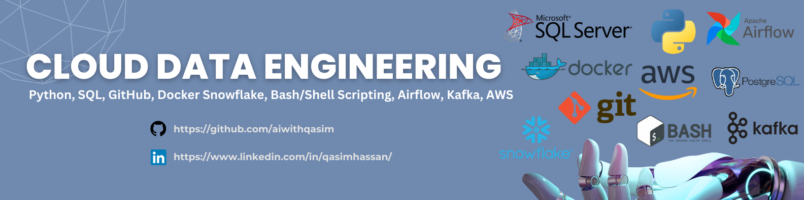

# cloud-data-engineering-101



This repository include the Roadmap for Data Engineering. Since Data Engineering is a broad field we'll try to cover following tools.

NOTE: It is a first draft of the course we'll Keep on updating.

## Python

Today’s data-driven organizations rely on efficiency in data engineering tasks. As the demand for data increases, teams must have the ability to collect, process, and store extremely large volumes of data, and Python has emerged as a vital asset for accomplishing this mission. Teams use Python for data engineering tasks due to its flexibility, ease of use, and rich ecosystem of libraries and tools. that is why Python should be the first step toward Data Engineering. Following tis the repo in which we covered Python Programming.

- [Python Programming](https://github.com/aiwithqasim/Saylani_Python_911)

## NumPy, Pandas, Matplotlib

Since Data Engineering  is the field  in which you have to play around with the data so Basic Exploratory Data Analysis skills are required to play around with data for that we'll be coving NumPy Pandas & Matplotlib  for EDA but we'll give a keen foucs on Pandas in this section.

- [EDA using Numpy Pandas & Matplotlib](https://github.com/aiwithqasim/Explorartory_Data_Analysis)

- [Task -1 Investigating Netflix Movies and Guest Stars in The Office](https://github.com/aiwithqasim/datascience-projects/tree/main/Investigating%20Netflix%20Movies%20and%20Guest%20Stars%20in%20The%20Office)
- [Task -2 The Android App Market on Google Play](https://github.com/aiwithqasim/datascience-projects/tree/main/The%20Android%20App%20Market%20on%20Google%20Play/The%20Android%20App%20Market%20on%20Google%20Play)
- [Task -3 The GitHub History of the Scala Language](https://github.com/aiwithqasim/datascience-projects/tree/main/The%20GitHub%20History%20of%20the%20Scala%20Language)

## SQL (PostgresSQL & T-SQL)

When You have know Python & basic Data Analysis then for Data Engineeering Next Step shoudl be to know about Database & how to intereact with them. SQL is the most common laguage to that is been used for Databases/DataWareshousing from decads. So, we'll cover SQL as  query language for databases & we'll try to cover two flavours of SQL i:3. T-SQL & PostgresSQL.

- content material to be announced.

- [Project -1 Getting started with ETL using Python + Pandas + SQL](https://www.youtube.com/watch?v=uL0-6kfiH3g&list=PLBTZqjSKn0Ie0FvR3_ass_iTIqYV_CAth&index=2)

## Snowflake

To be summarize we're targetting cloud data engineering & snowflake is kind of cloud data warehoursing solution that data idustry have adopt extensively. Only SQL is used in snowflake which make the perfect combo to learn after we have covered SQL (PostgresSQL & T-SQL).

- [Snowflake – The Complete Masterclass](https://awscloudclubs.udemy.com/course/snowflake-masterclass/)
- Snowflake Batches courses 

1. Batch 1: http://learn.snowflake.com/en/courses/uni-essdww101/
2. Batch 2: http://learn.snowflake.com/en/courses/uni-ess-cmcw/
3. Batch 3: http://learn.snowflake.com/en/courses/uni-ess-dabw/
4. Batch 4: http://learn.snowflake.com/en/courses/uni-ess-dlkw/
5. Batch 5: http://learn.snowflake.com/en/courses/uni-ess-dngw/

- [Project -2 Snowflake real time Data Warehouse for beginners](https://www.projectpro.io/project-use-case/snowflake-real-time-data-warehouse-project-for-beginners)
- [Project -3 Change Data Captue Pipeline with Snowflake & AWS ](https://www.projectpro.io/project-use-case/how-to-implement-slowly-changing-dimensions-in-snowflake)

## Bash/Shell Scripting & Liux Commands

Bash/Shell scripting and Linux commands are vital in a Cloud Data Engineering roadmap due to their automation capabilities, essential for tasks like data processing and infrastructure management. Proficiency ensures flexibility, troubleshooting skills, and compatibility with cloud platforms. Cost optimization through efficient resource usage and the ability to streamline version control and deployment processes further emphasizes their importance.

- [Introduction to Shell](https://www.datacamp.com/courses/introduction-to-shell)
- [Introduction Bash Scripting](https://www.datacamp.com/courses/introduction-to-bash-scripting)
- [Data processing in Shell](https://www.datacamp.com/courses/data-processing-in-shell)

- **Project -4 Security Log Analysis**
You're responsible for the security of a server, which involves monitoring a log file named security.log. This file records security-related events, including successful and failed login attempts, file access violations, and network intrusion attempts. Your goal is to analyze this log file to extract crucial security insights.
Create a sample log file named `security.log` with the following format:

```
2024-03-29 08:12:34 SUCCESS: User admin login
2024-03-29 08:15:21 FAILED: User guest login attempt
2024-03-29 08:18:45 ALERT: Unauthorized file access detected
2024-03-29 08:21:12 SUCCESS: User admin changed password
2024-03-29 08:24:56 FAILED: User root login attempt
2024-03-29 08:27:34 ALERT: Possible network intrusion detected.
```

## Docker w.r.t data engineering

Docker is integral to a Cloud Data Engineering roadmap for its ability to encapsulate data engineering environments into portable containers. This ensures consistency across development, testing, and production stages, facilitating seamless deployment and scaling of data pipelines. Docker's lightweight nature optimizes resource utilization, enabling efficient utilization of cloud infrastructure. Moreover, it promotes collaboration by simplifying the sharing of reproducible environments among team members, enhancing productivity and reproducibility in data engineering workflows.

- [Intro to Docker & using Docker in Cloud Data Engineering](https://www.youtube.com/watch?v=98dp_4m2nO8)
- [45-Minute Guide to Basic Data Engineering with Docker, PostgreSQL, and Python](https://www.youtube.com/watch?v=pqL24EHPwqw)

- [Project -4 Twitter Data Pipeline using Airflow](https://www.youtube.com/watch?v=q8q3OFFfY6c&t=1665s)

## Airflow

When we have a Data Pipeline & we want to trigger it on daily basis so we need some kind of automation or orchestration tool that can automate our orchestration part. for that purposes Airflow is the quite adopted choice to learn that why we have airflow in our roadmap.

- [The Complete Hands-On Introduction to Apache Airflow](https://awscloudclubs.udemy.com/course/the-complete-hands-on-course-to-master-apache-airflow/)

- [Project -5 Automate a python ETL pipeline with airflow on AWS EC2](https://www.youtube.com/watch?v=uhQ54Dgp6To)
- [Project -6 Deploying Airflow with Docker](https://www.youtube.com/watch?v=COMEVcZtx1s)

## Kafka

When data is coming in the real-time fashion & suppose we don't have end destination ready to consume that data or let say any diaster happen. In this case we'll lose our data. This itroduce the need of de-coupling tool that can seperate both produce ends of the data & consumer end of the & act as mediator.

- [Apache Kafka Series - Learn Apache Kafka for Beginners](https://awscloudclubs.udemy.com/course/apache-kafka/)

- [Project -7 Stock Market Real-Time Data Analysis Using Kafka](https://www.youtube.com/watch?v=KerNf0NANMo&t=318s)

## AWS

AWS is crucial in a Cloud Data Engineering roadmap due to its comprehensive suite of services tailored for data processing, storage, and analytics. Leveraging AWS allows data engineers to build scalable and cost-effective data pipelines using services like S3, Glue, and EMR. Integration with other AWS services enables advanced analytics, machine learning, and real-time processing capabilities, empowering data engineers to derive valuable insights from data. Furthermore, AWS certifications validate expertise in cloud data engineering, enhancing career prospects and credibility in the industry.

- [Data Engineering with AWS Services](https://www.udemy.com/course/data-engineering-using-aws-analytics-services/)

- [Project -8 Batch Data Pipeline Using S3, lambda & Cloud Watch](https://www.youtube.com/watch?v=FF6SQEHBW0k)
- [Project -9 ETL pipeline using Glue, Athena & S3](https://www.youtube.com/watch?v=yIc5a7C8aHs)
- [Project -10 Super Store Data Analysis Using Glue & Quick Sight](https://www.youtube.com/watch?v=52CWagk3-jw)
- [Project -11 Extract and Transform Redfin data with AWS EMR ](https://www.youtube.com/watch?v=PeaLln90YXg&list=PLACD_PaYcVF0wXU-UIuC6mhvJZ0uu0TlP&index=1)
- [Project -12 End-To-End Data Engineering Project ](https://www.youtube.com/watch?v=efeP4IaOC8I)