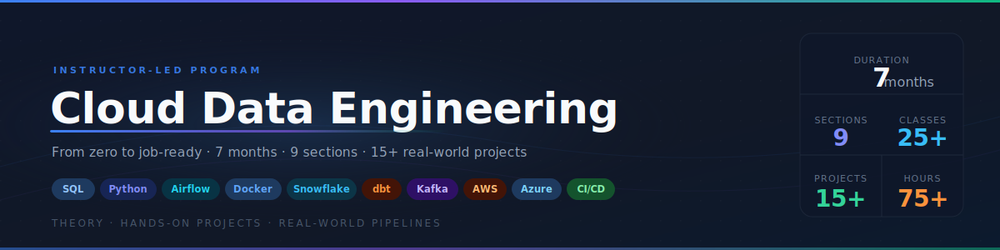

# CLOUD DATA ENGINEERING

  
  
  
  
  

---

  
  
  
  
  
  
  
  
  
  

---

## 📑 Table of Contents

1. [Course Summary](#-course-summary)
2. [Week 1 — Orientation](#-week-1--orientation)
3. [Section 1 — SQL](#-section-1--sql-4-weeks)
4. [Section 2 — Python](#-section-2--python-4-weeks)
5. [Section 3 — Airflow](#-section-3--airflow-2-weeks)
6. [Section 4 — CI/CD, Docker & Bash Scripting](#-section-4--cicd-docker--bash-scripting-2-weeks)
7. [Section 5 — Agentic Vibe Engineering](#-section-5--agentic-vibe-engineering-1-week)
8. [Section 6 — Snowflake + DBT](#-section-6--snowflake--dbt-4-weeks)
9. [Section 7 — Kafka](#-section-7--kafka-2-weeks)
10. [Section 8 — AWS](#-section-8--aws-4-weeks)
11. [Section 9 — Azure](#-section-9--azure-3-weeks)
12. [Why These Technologies?](#-why-these-technologies)

---

## 🗓 Course Summary

Welcome to the **Cloud Data Engineering** course — a comprehensive, instructor-led program designed to take you from zero to job-ready as a Cloud Data Engineer.

| Section | Topic | Duration |
|---------|-------|----------|
| Week 1 | Orientation, Setup, GitHub, LinkedIn | 1 week |
| Section 1 | SQL | 4 weeks |
| Section 2 | Python | 4 weeks |
| Section 3 | Apache Airflow | 2 weeks |
| Section 4 | CI/CD, Docker & Bash Scripting | 2 weeks |
| Section 5 | Agentic Vibe Engineering | 1 week |
| Section 6 | Snowflake + DBT | 4 weeks |
| Section 7 | Apache Kafka | 2 weeks |
| Section 8 | AWS | 4 weeks |
| Section 9 | Azure | 3 weeks |
| **Total** | | **~27 weeks (~7 months)** |

### Delivery Approach

- **Format:** Instructor-led live classes (3 hours each), recorded for replay
- **Frequency:** 2–3 classes per week
- **Each section includes:** Theory + hands-on coding + real-world projects
- **Projects:** Every major section closes with at least one end-to-end project
- **Support:** Community forum + office hours for doubt resolution
- **Prerequisites:** Basic computer literacy; no prior data engineering experience needed

📂 [Understanding Data Engineering (PPT)](./docs/Understanding%20Data%20Engineering.pptx)

---

## 🟢 Week 1 — Orientation

**Duration: 1 week**

- Environment setup (VS Code, Git, Python, WSL)
- GitHub account setup & repository basics
- LinkedIn profile optimization for data engineering roles
- Roadmap walkthrough — what to expect from the course

---

## 🗄️ Section 1 — SQL *(4 weeks)*

**7 classes + 1 capstone project | 3 Snowflake badges**

| Class | Topic | Duration |
|-------|-------|----------|
| Class 1 | Querying, Sorting, Filtering & Set Operators | 3 hrs |
| Class 2 | Joins & Views | 3 hrs |
| Class 3 | Grouping, Subqueries & Useful Tips | 3 hrs |
| Class 4 | Modifying Data, DDL, Data Types & Constraints | 3 hrs |
| Class 5 | CTEs, Pivot, Expressions & Window Functions | 3 hrs |
| Class 6 | Indexes & Stored Procedures | 3 hrs |
| Class 7 | Interview Prep + Capstone Project | 3 hrs |

**What you'll cover:**
- SELECT, filtering, sorting, set operators (UNION, INTERSECT, EXCEPT)
- All JOIN types, Views (including indexed/materialized views)
- GROUP BY, ROLLUP, CUBE, GROUPING SETS, subqueries, EXISTS/ANY/ALL
- DML (INSERT, UPDATE, DELETE, MERGE), DDL, data types, constraints
- CTEs (including recursive), PIVOT/UNPIVOT, CASE expressions
- Window functions: ROW_NUMBER, RANK, LAG, LEAD, FIRST_VALUE, aggregate windows
- Indexes (clustered, non-clustered, filtered, composite), stored procedures, error handling

**Capstone Project:**
- End-to-end project: schema design, data ingestion, analytical queries, views, stored procedures
- Snowflake Badge preparation walkthrough (3 badges)

---

## 🐍 Section 2 — Python *(4 weeks)*

**6 classes + 1 ETL project**

| Class | Topic | Duration |
|-------|-------|----------|
| Class 1 | Python Foundations | 3 hrs |
| Class 2 | Dictionaries, Input & String Handling | 3 hrs |
| Class 3 | Functions, Loops & OOP | 3 hrs |
| Class 4 | File Handling, CSV, JSON & Error Handling | 3 hrs |
| Class 5 | NumPy & Matplotlib | 3 hrs |
| Class 6 | Pandas | 3 hrs |
| + | Classes, Web Scraping (video resources) | — |

**What you'll cover:**
- Variables, control flow, lists, tuples, dictionaries, loops
- Functions (default args, \*args, closures), OOP (classes, methods, attributes)
- File I/O, CSV, JSON, exception handling
- NumPy arrays, statistics, random data generation
- Matplotlib: line, scatter, histogram, chart customization
- Pandas: DataFrames, indexing (loc/iloc), filtering, groupby, merging, visualization

**Project:** ETL pipeline with Python + Pandas + SQL

---

## ⏳ Section 3 — Airflow *(2 weeks)*

**3 classes**

| Class | Topic | Duration |
|-------|-------|----------|
| Class 1 | Introduction, Architecture & Setup (Docker + WSL) | 3 hrs |
| Class 2 | Weather ETL Project — End-to-End Airflow Pipeline | 3 hrs |
| Class 3 | Parallel ETL Pipeline on AWS | 3 hrs |

**What you'll cover:**
- DAG concept, core components (Scheduler, Executor, Webserver, Metadata DB, XCom)
- Executor types (Local, Celery, Kubernetes), task lifecycle, Connections & Variables
- Airflow 2.x vs 3.0: TaskFlow API, event-driven scheduling (Assets), React UI
- PythonOperator, HttpSensor, HttpOperator, SQLExecuteQueryOperator, PostgresHook
- TaskGroups for parallel execution, retry policies, backfilling

**Projects:**
- **Weather ETL Pipeline** — Daily pipeline using Open-Meteo API → pandas → SQLite, deployed via Docker Compose
- **Parallel ETL on AWS** — Production-style parallel pipeline: OpenWeather API + S3 CSV → RDS PostgreSQL → S3 export, using TaskGroups on AWS EC2

---

## 🐋 Section 4 — CI/CD, Docker & Bash Scripting *(2 weeks)*

**2 classes**

| Class | Topic | Duration |
|-------|-------|----------|
| Docker Class 1 | Docker Fundamentals + PostgreSQL + Data Ingestion | 3 hrs |
| CI/CD Class 1 | Continuous Integration & Deployment for Data Engineers | 3 hrs |

**What you'll cover:**

**Docker:**
- Containers vs VMs, core commands, volumes, networking
- Dockerizing Python pipelines, multi-stage builds with `uv`
- PostgreSQL in Docker, pgAdmin, Docker Compose for multi-container setups
- NY Taxi dataset ingestion with pandas + SQLAlchemy (chunked, CLI-parameterized)

**CI/CD:**
- GitHub Actions: workflows, triggers, jobs, steps, runners, secrets
- Code quality: `ruff`, `mypy`, `sqlfluff`, pre-commit hooks
- Automated testing with `pytest` — unit, integration, data quality checks
- Docker image builds in CI, image scanning with `trivy`
- Deploying DAGs, dbt models, Terraform infra, Docker containers via CD pipelines
- End-to-end: Python ETL → GitHub Actions → Docker → AWS

---

## 🤖 Section 5 — Agentic Vibe Engineering *(1 week)*

**What you'll cover:**
- Deep dive into **Claude Code** (Skills, MCP, Hooks, Subagents, Sandboxes, Orchestrators)
- Hands-on with Cursor, Codex, Antigravity, Copilot, OpenCode, and Amp
- Swarms, Agent Teams, Claude Agent SDK
- Ralph Loops, GSD, Gas Town, OpenClaw, sprites.dev

**Tools:** Cursor · Codex · Antigravity · Claude · Copilot

---

## ❄️ Section 6 — Snowflake + DBT *(4 weeks)*

 

**4 projects**

**What you'll cover:**
- Snowflake architecture: databases, schemas, roles, virtual warehouses
- Data loading methods: Web UI, SnowSQL CLI, S3 integration, Snowpipe
- Streams, Tasks, Stored Procedures, Time Travel, query optimization, cost management
- dbt: models, sources, tests, documentation, snapshots, macros, CI/CD integration
- SCD Type 1 & Type 2 using Snowflake Streams & Tasks

**Projects:**

- **Snowflake Data Loading** — Multiple ingestion methods: Web UI, SnowSQL CLI, AWS S3 with IAM roles & Snowpipe, Time Travel, optimization, and cost management.
  - 🔗 [Repo](https://github.com/aiwithqasim/snowflake-loading-data)

- **SCD Data Warehousing** — End-to-end pipeline implementing SCD Type 1 & 2. Python (Faker) generates data on EC2 → Apache NiFi moves files to S3 → Snowpipe ingests → Streams & Tasks handle CDC logic. Infrastructure via Terraform.
  - 🔗 [Repo](https://github.com/aiwithqasim/scd-data-warehousing-with-snowflake)

- **DBT Fundamentals** — Ultimate guide to dbt: models, sources, tests, docs, snapshots, macros, and CI/CD integration. From setup to production-grade project structure.
  - 🎥 [Video](https://www.youtube.com/watch?v=B8uwFmVt4sU)

- **End-to-End Banking Data Engineering (Snowflake + dbt + Airflow)** — Full ELT pipeline on real-world banking data: raw ingestion into Snowflake, dbt staging/mart layers, data quality tests, and Airflow DAGs for orchestration.
  - 🎥 [Video](https://www.youtube.com/watch?v=uHiyZitmIS0&t=14475s)

---

## 📡 Section 7 — Kafka *(2 weeks)*

**3 classes**

| Class | Topic | Duration |
|-------|-------|----------|
| Class 1 | Installation + Theory + Hands-on | 3 hrs |
| Class 2 | Stock Market Kafka Project | 3 hrs |
| Class 3 | Kafka CDC Project | 3 hrs |

**What you'll cover:**
- Kafka architecture: topics, partitions, producers, consumers, brokers, offsets
- Setup via Docker and manual deployment on AWS EC2
- Python-based producer/consumer implementations
- Real-time event streaming, Change Data Capture (CDC)

**Projects:**

- **Kafka 101 — Fundamentals & Stock Market Pipeline** — Core Kafka concepts with hands-on Python producer/consumer pipeline ingesting live stock market data through Kafka topics on AWS EC2.
  - 🔗 [Repo](https://github.com/aiwithqasim/kafka101)

- **Smart City Real-Time Streaming (Kafka + AWS)** — End-to-end IoT data ingestion and streaming project. Covers Kafka streaming, AWS services integration, and building a production-grade pipeline to process and visualize city-wide sensor data.
  - 🎥 [Video](https://www.youtube.com/watch?v=Vv_fvwF41_0&t=442s)

---

## ☁️ Section 8 — AWS *(4 weeks)*

**3 tracks + 1 capstone**

### Track 1 — AWS Data Warehousing
*(Glue · Crawler · Athena · Redshift · S3)*

End-to-end AWS data engineering series: S3 ingestion → Glue Crawler schema discovery → Glue ETL transformations → serverless Athena queries → Redshift analytics → QuickSight dashboarding. Includes Python, SQL, IAM, and real-world project.

- 🎥 [Playlist](https://www.youtube.com/watch?v=QHIOX_RqjLI&list=PLBJe2dFI4sgt-9GR2j-rTeKtimE9pfqyt)

### Track 2 — Event Driven Architecture
*(Lambda · SQS · Step Functions · SNS · EventBridge)*

- **S3 + Lambda + CloudWatch (Stock Prices)** — Serverless pipeline automating stock price data processing via S3-triggered Lambda. Covers S3 event configuration, Lambda deployment & optimization, and CloudWatch monitoring.
  - 🔗 [Repo](https://github.com/aiwithqasim/s3-lambda-cloudwatch-stockprices)

- **Snowflake + S3 + Lambda + EventBridge (Currency Exchange Rates)** — Scheduled serverless ETL fetching live exchange rates via Lambda → raw JSON to S3 → structured data loaded into Snowflake via stored procedures. EventBridge for scheduling, Secrets Manager for credentials.
  - 🔗 [Repo](https://github.com/aiwithqasim/snowflake-s3-lambda-eventbridge-rule)

### Track 3 — Infrastructure as Code
*(ECS · EKS · CodePipeline · Terraform)*

- Provisioning and managing AWS infrastructure as code using Terraform
- Container orchestration with ECS and EKS
- Automated deployment pipelines with CodePipeline

### AWS Capstone Project

**AWS Masterclass for Data Engineers** — Full-stack AWS data engineering project tying together S3, Glue, Athena, Redshift, Lambda, EventBridge, SQS, SNS, and Step Functions into a production-grade end-to-end pipeline.

- 🎥 [Video](https://www.youtube.com/watch?v=yvAWbbQa8eE&t=95s)

---

## 🔷 Section 9 — Azure *(3 weeks)*

**3 tracks**

- **Medallion Architecture (ADF + Databricks)** — Implement Bronze/Silver/Gold layered data architecture using Azure Data Factory for ingestion and Azure Databricks for transformation.

- **Azure Fabric** — End-to-end analytics platform: data integration, real-time intelligence, data warehousing, and Power BI reporting in a unified SaaS environment.

- **Azure Synapse Analytics** — Unified analytics service combining big data processing and enterprise data warehousing with dedicated and serverless SQL pools.

---

## ❓ Why These Technologies?

The technologies in this course — Python, SQL, Snowflake, dbt, Airflow, Kafka, AWS, Azure — are **the most in-demand** in the data engineering industry today.

Each section builds on the previous one, reinforcing both theory and hands-on practice so you are **job-ready** by the end.

---

## 📝 Final Notes

Throughout this course you will engage in **hands-on projects, assignments, and real-world case studies** that simulate production data engineering challenges.

⚡ Get ready to embark on this exciting journey of becoming a **proficient Cloud Data Engineer!** 🚀

---
